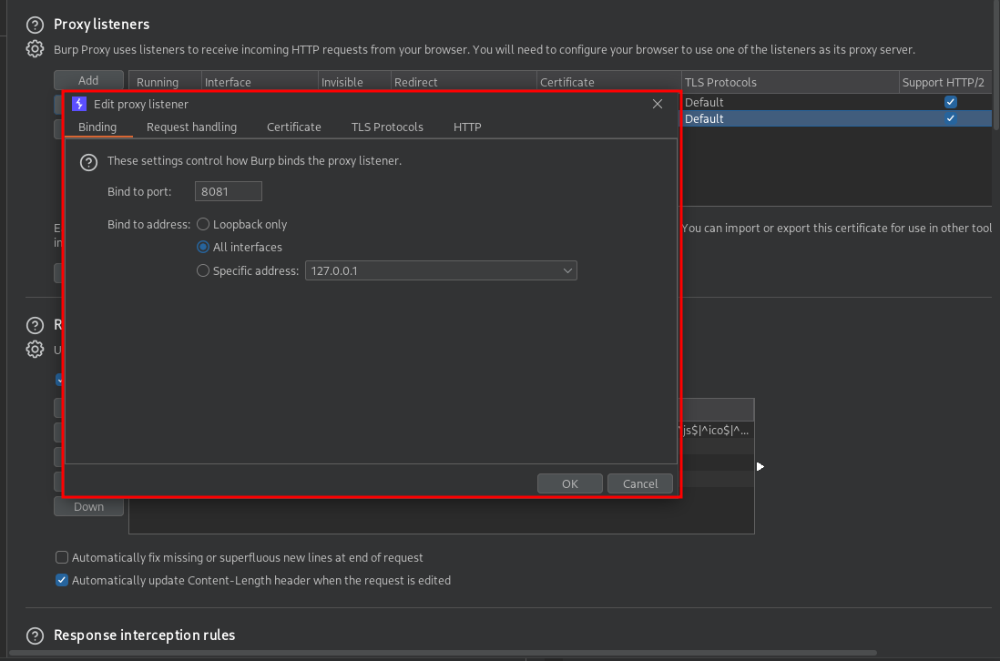

---

### Course [Link](https://www.udemy.com/course/the-complete-guide-to-android-bug-bounty-penetration-tests/)

## Setting Up the App

1. Download the apk
2. install it in your emulator `adb install app.apk` 

---

## Rooted the device

**Create the Emulator**

- Open **Android Studio**
- Go to **Tools → Device Manager**
- Click **Create Virtual Device**
- Choose any device (e.g., Pixel 3)
- Click **Next**

Choose the Correct System Image (**CRITICAL STEP**)

✔ Select an image with:

```
Android XX
Google APIs
x86 / x86_64

```

❌ Do NOT select:

```
Google Play

```

> Google Play images are production builds and cannot be rooted
> 

---

**Verify Device Connection**

From your host machine (Kali / Linux / macOS):

```bash
adb devices

```

You should see:

```
emulator-5554   device

```

Clone

source https://www.youtube.com/watch?v=pcwRWBHFAlg

```json
git clone https://gitlab.com/newbit/rootAVD.git
cd rootAVD
./rootAVD.sh ListAllAVDs
```

---

---

## **Setting up Burp suite for android**

### **Configure Burp Proxy**



### **Configure Android Emulator Proxy**

Emulator Wi‑Fi Settings

1. Open **Android Settings**
2. Network & Internet → **Wi‑Fi**
3. Long‑press on connected network
4. Modify network
5. Advanced options:

```json
Proxy: Manual
Proxy hostname: 10.0.2.2
Proxy port: 8081

```

### **Install Burp CA Certificate (User Cert)**

Download Certificate

From emulator browser:

```
http://burp

```

Download:

```
cacert.der
```

> If the emulator can’t see this extension you can do this steps
1- you can install the burp CA from your kali
2- change to `.crt`  by this command `mv cacert.der cacert.crt`
3- Push to the emulator `adb push cacert.crt /sdcard/Download/`
> 

**Install Certificate**

- Settings → Security
- Encryption & credentials
- Install a certificate → **CA certificate**
- Name it: `Burp`

⚠️ This installs a **user certificate** only

**Why User Cert Is Not Enough (Android 7+)**

> From Android 7+:
 - Apps **do NOT trust user CA certificates
 -** Most apps will still fail HTTPS
➡️ **System CA is required** (root needed)
> 

**Install Burp CA as System Certificate (ROOT)**

Convert Certificate

```json
openssl x509 -inform DER -in cacert.der -out burp.pem
openssl x509 -inform PEM -subject_hash_old -in burp.pem | head -1
```

Example output:

```json
9a5ba575
```

Rename:

```json
mv burp.pem 9a5ba575.0
```

**Push Certificate to Emulator**

```json
adb root
adb remount
adb push 9a5ba575.0 /system/etc/security/cacerts/
adb shell chmod 644 /system/etc/security/cacerts/9a5ba575.0
adb reboot

```

Test HTTPS Interception

> Run app or browser:
 - HTTPS traffic should appear in Burp
 - No SSL errors → ✅ success
> 

## Pulling the Apk files from android devices

```json
adb shell
pm list packages
pm path com.android.insecurebankv2
exit
adb pull /data/app/com.android....../base.apk
```

## Decompiling Apks with Apktool and Dex2Jar

### Using Apktool (Best for resources + smali)

```json
apktool d app.apk -o app_decoded
```

> What you get
> 
> - `AndroidManifest.xml` (decoded)
> - `res/` → layouts, strings, XML configs
> - `smali/` → Dalvik bytecode
> - `assets/` → often contains secrets 👀

### Using JADX (Convert DEX → Java)

JADX does **DEX → Java directly** (better than dex2jar in many cases)

```json
sudo apt install jadx
jadx app.apk
```

> **Best for**
> 
> - Understanding business logic
> - Reading Java/Kotlin source
> - Finding auth logic, crypto, hardcoded creds